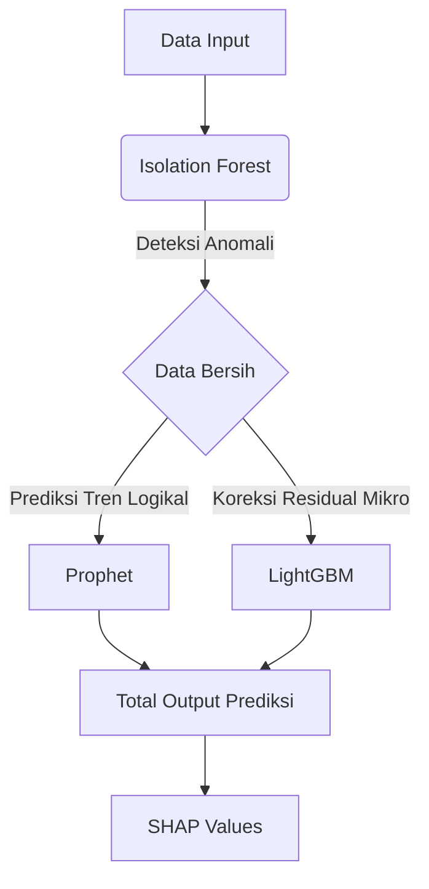

# Dokumentasi Utama: Bab 2 Metodologi AI (Hybrid AI Electricity Demand Forecasting)

## 1. Ringkasan Eksekutif
Proyek ini menguraikan pipeline prediktif mutakhir untuk analitik permintaan listrik nasional menggunakan **Arsitektur Hibrida Prophet + LightGBM**. Metodologi inti menghindari tebakan teoritis dengan membungkus keseluruhan arsitektur di dalam **Optuna Bayesian Optimization Engine**, mengintegrasikan tren makroekonomi dengan pelacakan fluktuasi mikro secara sempurna, sambil tetap dilindungi secara matematis oleh filter anomali **Isolation Forest**.

---

## 2. Metodologi AI

Bab ini menguraikan fondasi teknis arsitektur cerdas yang digunakan dalam proyek komprehensif, mencakup dataset, arsitektur, pre-processing, hingga matriks evaluasi akhir.

### 2.1 Dataset
Pembangunan model peramalan prediktif dilakukan menggunakan enam sumber set data multidimensi yang digabungkan:

| Dataset | Sumber | Periode | Jumlah Sampel | Fitur Utama |
| :--- | :--- | :--- | :--- | :--- |
| Buku Statistik Ketenagalistrikan 2024 | ESDM/Ditjen Gatrik | s.d. 2024 | - | Kapasitas, produksi, distribusi |
| Konsumsi Listrik per Kapita | BPS | Multitahunan | - | Konsumsi nasional |
| Listrik Didistribusikan per Provinsi | BPS | 2014–2022 | 38 provinsi | GWh per provinsi |
| Monthly Electricity Data | Ember Energy | - | 85 geografi | Pembangkitan, emisi, permintaan bulanan |
| Electric Power Consumption | World Bank | Multidekade | - | kWh/kapita Indonesia |
| Climate Data Daily IDN | Kaggle (BMKG) | 2010–2022 | ±589.265 baris | 19 fitur cuaca |

### 2.2 Arsitektur Model (4-Komponen Utama)
Keberhasilan utama peramalan ini bergantung pada ketidakmampuan algoritma tunggal dalam menangani perubahan serentak. Kami menggunakan sinergi **Arsitektur 4-Komponen** berikut:

**Penjelasan Masing-Masing Peran:**
1. **LightGBM:** Berfungsi sebagai *regressor* utama untuk prediksi presisi target nilai kWh. LightGBM disuapi murni fitur eksogen (cuaca, libur, lags) untuk mendeteksi *di mana persisnya Prophet akan meleset*, memprediksi selisih rentang error (*residual*).
2. **Prophet:** Bertindak sebagai fondasi pilar makro algoritmik, menangkap secara kokoh rekam jejak eksklusif pola musiman (*seasonality*) dan meredam seluruh efek anomali khusus hari libur nasional (*changepoints*).
3. **SHAP Values:** Bertransformasi menjadi lapisan *explainability* murni di setiap celah keluaran (*output*) terakhir yang transparan. SHAP bertugas membedah alasan dan menerjemahkan ke otak manusia kenapa algoritma membuat prediksi (misal: rasio pengaruh curah hujan ke dalam deviasi kWh riil).
4. **Isolation Forest:** Mengabdi sebagai filter anomali di palang gerbang depan dengan mendeteksi otomatis penipuan target lonjakan/penurunan tak wajar pada kumpulan metrik listrik sebelum ditelan algoritma sehingga matematika peluruhan trennya benar-benar terlindung dari bias fisik.

### 2.3 Pre-processing (Pipeline 5 Tahapan)
Meramalkan jaringan listrik ekstrem membutuhkan struktur pemrosesan dataset yang sangat ketat untuk menghindari *Target Leakage*. Pipeline direalisasikan tepat ke dalam 5 manuver berurutan:

1. **Raw data ingestion:** Penarikan utuh seluruh aliran nilai data mentah dari enam sistem pangkalan data tanpa *filter* pada satu titik aglomerasi gabungan besar.
2. **Handling missing values via temporal interpolation:** Pemulusan selisih kosong antar-kolom temporal menggunakan metode interpolasi *timeline* linier secara terstruktur, mencegah jaringan logika ML tersandung lubang kekosongan fitur cuaca tak bertuan.
3. **Outlier detection via IQR + Isolation Forest:** Implementasi eliminasi *outlier* bertingkat; memanfaatkan detektor jangkauan interkuartil yang didukung oleh deteksi lintasan algoritmik dari Isolation Forest (khusus pada data murni masa lalu) agar Puncak Produksi legal tidak terhapus.
4. **Feature engineering (lag variables, rolling average, fitur kalender):** Rekayasa fitur momentum listrik dengan menginjeksi elemen turunan pergerakan beruntun: data *autoregresif* riwayat kemarin (`Lag_1`), histori persilangan mingguan (`Lag_7`), momentum lintasan rata-rata dinamis (`Rolling_7`), dan flag status kalender (*Is_Weekend*, *Is_Holiday*).
5. **Time-based split 70/15/15:** Matriks dikarantina kronologis (tanpa `.shuffle()`) dengan arsitektur masa lalu, masa kini, dan masa depan; secara terurut terpecah mutlak **70% Pelatihan / 15% Validasi / 15% Pengujian**. Waktu tak berputar.

### 2.4 Metrik Evaluasi Kinerja Otomatis
Penilaian arsitektur diisolasi eksklusif pada pembagian karantina set 15% Test. Metrik validasinya difokuskan pada tujuan prediktif ganda:

**Metrik Forecasting:**
- **Mean Absolute Percentage Error (MAPE):** Evaluator standar metrik persentase mutlak utama (Dengan target absolut: MAPE < 10%). Menilai kepantasan proporsi fraksi deviasi model vs daya kelistrikan total yang riil.
- **Mean Absolute Error (MAE):** Mengkalkulasi mutlak *range* defleksi jarak numerik (Megawatt) nilai yang diramalkan vs target fisika sempurna di lapangan.
- **Root Mean Squared Error (RMSE):** Algoritma penjagal untuk mendenda model lewat kemelesetan mematikan. Mengamankan keakuratan fluktuasi peramalan dengan memberi beban berlipat tinggi terhadap rentang defleksi ekstrem/outlier fatal.

**Metrik Anomaly Detection (Isolation Forest):**
- **Precision:** Mendefinisikan derajat ketepatan. Seberapa akurat mesin dalam membuktikan insiden anomali yang ia tandai adalah benar-benar keruntuhan sirkuit cuaca (*True Positive*) dan tidak mengecoh.
- **Recall:** Mendefinisikan penelusuran. Seberapa utuh persentase gelombang anomali ekstrem yang benar-benar berhasil dipetakan sebelum menembak peluit dan dibersihkan dari matriks.
- **F1-Score:** Pilar peredam ekuilibrium dan perimbangan harmonik sempurna untuk menangkal pertarungan timpang tindih antara metrik Precision dan Recall di ranah isolasi target peramalan.

---

## 3. Joint Bayesian Optimization (Optuna)
Alih-alih membuang waktu mengandalkan pencarian grid (grid search) primitif, perombakan masif arsitektur ini membungkus segalanya secara tunggal di dalam mesin pencarian probabilistik **Optuna TPESampler**. Optuna mendesain perbatasan optimasi yang beradaptasi secara tersinkronisasi murni di sekeliling model secara serempak (`contamination` Isolation Forest + skala `changepoint/seasonality` Prophet + titik persimpangan `Learning Rate / Max Depth` LightGBM). TPESampler bekerja secara replikasi deterministik `seed=0` dan dirancang dengan protokol pemutus dini `early_stopping` otomatis dari kecacatan *overfeeding*.

---

> *"Predicting the future of human electricity consumption by synthesizing mathematical trends and environmental chaos."*
