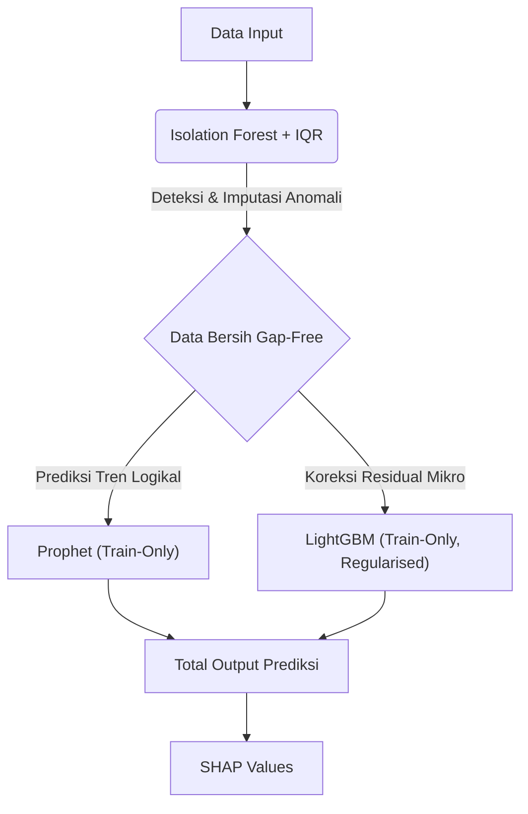

# Dokumentasi Utama: Bab 2 Metodologi AI (Hybrid AI Electricity Demand Forecasting)

## 1. Ringkasan Eksekutif
Proyek ini menguraikan pipeline prediktif mutakhir untuk analitik permintaan listrik nasional menggunakan **Arsitektur Hibrida Prophet + LightGBM**. Metodologi inti menghindari tebakan teoritis dengan membungkus keseluruhan arsitektur di dalam **Optuna Bayesian Optimization Engine**, mengintegrasikan tren makroekonomi dengan pelacakan fluktuasi mikro secara sempurna, sambil tetap dilindungi secara matematis oleh filter anomali **Isolation Forest**.

**Prinsip Anti-Overfitting**: Seluruh model (Prophet dan LightGBM) dilatih **hanya pada data training**. Data validasi tidak pernah digunakan untuk melatih model — hanya sebagai _early-stopping monitor_. Ini memastikan Val dan Test keduanya **fully out-of-sample**, menghasilkan evaluasi yang jujur dan generalisasi yang nyata.

---

## 2. Metodologi AI

Bab ini menguraikan fondasi teknis arsitektur cerdas yang digunakan dalam proyek komprehensif, mencakup dataset, arsitektur, pre-processing, hingga matriks evaluasi akhir.

### 2.1 Dataset
Pembangunan model peramalan prediktif dilakukan menggunakan enam sumber set data multidimensi yang digabungkan:

| Dataset | Sumber | Periode | Jumlah Sampel | Fitur Utama |
| :--- | :--- | :--- | :--- | :--- |
| Buku Statistik Ketenagalistrikan 2024 | ESDM/Ditjen Gatrik | s.d. 2024 | - | Kapasitas, produksi, distribusi |
| Konsumsi Listrik per Kapita | BPS | Multitahunan | - | Konsumsi nasional |
| Listrik Didistribusikan per Provinsi | BPS | 2014–2022 | 38 provinsi | GWh per provinsi |
| Monthly Electricity Data | Ember Energy | - | 85 geografi | Pembangkitan, emisi, permintaan bulanan |
| Electric Power Consumption | World Bank | Multidekade | - | kWh/kapita Indonesia |
| Climate Data Daily IDN | Kaggle (BMKG) | 2010–2022 | ±589.265 baris | 19 fitur cuaca |

### 2.2 Arsitektur Model (4-Komponen Utama)
Keberhasilan utama peramalan ini bergantung pada ketidakmampuan algoritma tunggal dalam menangani perubahan serentak. Kami menggunakan sinergi **Arsitektur 4-Komponen** berikut:

**Penjelasan Masing-Masing Peran:**
1. **Prophet (Train-Only):** Bertindak sebagai fondasi pilar makro algoritmik. Dilatih **hanya pada data training** untuk menangkap secara kokoh pola musiman (_seasonality_) dan tren tahunan. Menggunakan `Avg_Temp` sebagai _exogenous regressor_ agar model mengerti korelasi cuaca-demand. Dengan `changepoint_prior_scale` yang diperketat (0.001–0.1), tren dibuat halus dan stabil — mencegah Prophet terlalu fleksibel mengikuti noise.
2. **LightGBM (Train-Only, Regularised):** Berfungsi sebagai _regressor_ koreksi residual. Dilatih **hanya pada data training** untuk mempelajari di mana Prophet meleset. Menggunakan 18 fitur eksogen (cuaca, lag, rolling, temporal, kalender) dengan regularisasi berlapis: pohon dangkal (`max_depth: 2–4`), daun sedikit (`num_leaves: 4–15`), L1/L2 penalty, `extra_trees=True`, dan `min_child_samples: 15–60`. Validasi set digunakan hanya sebagai _early-stopping monitor_.
3. **SHAP Values:** Lapisan _explainability_ yang membedah alasan keputusan AI. SHAP bertugas menerjemahkan ke otak manusia kenapa algoritma membuat prediksi (misal: rasio pengaruh curah hujan ke dalam deviasi MWh riil).
4. **Isolation Forest + IQR:** Filter anomali di palang gerbang depan dengan **strategi imputasi** (bukan penghapusan). Anomali dideteksi lalu **diganti** dengan rata-rata 7 hari data bersih terakhir — memastikan dataset tetap utuh dan gap-free.

### 2.3 Pre-processing (Pipeline 5 Tahapan)
Meramalkan jaringan listrik ekstrem membutuhkan struktur pemrosesan dataset yang sangat ketat untuk menghindari *Target Leakage*. Pipeline direalisasikan tepat ke dalam 5 manuver berurutan:

1. **Raw data ingestion:** Penarikan utuh seluruh aliran nilai data mentah dari enam sistem pangkalan data tanpa *filter* pada satu titik aglomerasi gabungan besar.
2. **Handling missing values via Machine Learning Imputation (KNN):** Pemulusan selisih kosong menggunakan algoritma *K-Nearest Neighbors* yang secara eksklusif dilatih (*fit*) pada partisi Train. Ini menjamin pengisian data bolong (*gaps*) di Val/Test mengikuti struktur pola cuaca natural tanpa kebocoran data (*zero leakage*) maupun patahan kurva matematis yang tidak wajar (*unnatural linear curves*).
3. **Outlier detection via IQR + Isolation Forest → Imputasi:** Implementasi deteksi *outlier* bertingkat; memanfaatkan detektor jangkauan interkuartil yang didukung oleh Isolation Forest. Anomali **tidak dihapus**, melainkan **diimputasi** dengan rata-rata 7 hari data bersih terakhir — memastikan integritas temporal dataset tanpa lubang (_gap-free time series_).
4. **Feature engineering (lag variables, rolling averages, fitur temporal):** Rekayasa fitur siklus diperluas menjadi 18 fitur fundamental. Meliputi elemen fluktuasi (*Month*, *DayOfYear*, *Trend*), pergerakan beruntun otoregresif eksponensial (`Lag_1`, `Lag_2`, `Lag_7`, `Lag_14`, `Lag_30`), lintasan rata-rata dinamis (`Rolling_7`, `Rolling_14`, `Rolling_30`), efek cuaca tunda (`Temp_Lag_1`), dan penanda kalender (*Is_Weekend*, *Is_Holiday*).
5. **Time-based split 70/15/15:** Matriks dikarantina kronologis (tanpa `.shuffle()`) dengan arsitektur masa lalu, masa kini, dan masa depan; secara terurut terpecah mutlak **70% Pelatihan / 15% Validasi / 15% Pengujian**. Waktu tak berputar.

### 2.4 Metrik Evaluasi Kinerja (3-Split Evaluation)
Evaluasi dilakukan terpisah pada **3 split**: Train (in-sample), Validation (fully out-of-sample), dan Test (fully out-of-sample). Evaluasi 3-split ini memungkinkan diagnosis presisi:

- **Train→Val Gap** = Indikator **Overfitting** (seberapa banyak performa turun saat model melihat data baru).
- **Val→Test Gap** = Indikator **Distribution Shift** (seberapa berbeda pola data di periode test vs validasi).

**Metrik Forecasting:**
- **Mean Absolute Percentage Error (MAPE):** Evaluator standar metrik persentase mutlak utama (Dengan target: MAPE < 5% untuk standar industri energi). Menilai proporsi fraksi deviasi model vs daya kelistrikan total yang riil.
- **Mean Absolute Error (MAE):** Mengkalkulasi mutlak *range* defleksi jarak numerik (Megawatt) nilai yang diramalkan vs target fisika sempurna di lapangan.
- **Root Mean Squared Error (RMSE):** Algoritma untuk mendenda model lewat kemelesetan mematikan. Mengamankan keakuratan fluktuasi peramalan dengan memberi beban berlipat tinggi terhadap rentang defleksi ekstrem/outlier fatal.

**Metrik Anomaly Detection (Isolation Forest):**
- **Precision:** Seberapa akurat mesin dalam membuktikan insiden anomali yang ia tandai adalah benar-benar anomali (*True Positive*).
- **Recall:** Seberapa utuh persentase gelombang anomali ekstrem yang berhasil dipetakan.
- **F1-Score:** Perimbangan harmonik sempurna antara Precision dan Recall.

---

## 3. Joint Bayesian Optimization (Optuna)
Alih-alih membuang waktu mengandalkan pencarian grid (grid search) primitif, perombakan masif arsitektur ini membungkus segalanya secara tunggal di dalam mesin pencarian probabilistik **Optuna TPESampler**. Optuna mendesain perbatasan optimasi yang beradaptasi secara tersinkronisasi murni di sekeliling model secara serempak:

### Parameter yang Dioptimasi & Alasan Pemilihan Range

**Isolation Forest:**
| Parameter | Range | Alasan |
|:---|:---|:---|
| `contamination` | 0.001–0.05 (log) | Skala log karena sensitivitas tinggi di angka kecil. Range 0.1–5% mencerminkan bahwa anomali listrik jarang terjadi — hanya pada kejadian ekstrem seperti pemadaman besar atau hari libur tak terduga. |

**Prophet:**
| Parameter | Range | Alasan |
|:---|:---|:---|
| `changepoint_prior_scale` | 0.001–0.1 (log) | **Diperketat dari default Prophet (0.05)**. Range sangat rendah ini memaksa tren bergerak halus dan stabil. Nilai > 0.1 membuat Prophet terlalu fleksibel — mengikuti noise harian alih-alih pola sesungguhnya, menyebabkan overfitting. |
| `seasonality_prior_scale` | 0.01–1.0 (log) | **Diperketat dari default Prophet (10.0)**. Membatasi amplitudo efek musiman agar tidak berlebihan. Demand listrik memiliki seasonality yang konsisten — tidak perlu amplitudo besar yang bisa menangkap noise. |
| `n_changepoints` | 5–20 | **Dikurangi dari range umum (25–50)**. Semakin sedikit changepoint = tren lebih mulus. 5–20 cukup untuk menangkap 3–4 perubahan struktural per tahun (musim kemarau/hujan, Ramadan) tanpa overfitting. |

**LightGBM (Regularisasi Berat):**
| Parameter | Range | Alasan |
|:---|:---|:---|
| `learning_rate` | 0.001–0.05 (log) | **Sangat rendah** untuk memastikan konvergensi lambat dan stabil. Learning rate rendah + early stopping = model berhenti di titik optimal, bukan di titik overfit. |
| `max_depth` | 2–4 | **Sangat dangkal**. Pohon kedalaman 2–4 hanya bisa menangkap interaksi fitur sederhana (mis: "jika hari kerja DAN suhu > 30°C"). Ini mencegah model menghafal pola noise yang kompleks. |
| `num_leaves` | 4–15 | **Sangat sedikit** (default LightGBM = 31). Membatasi jumlah "keputusan" per pohon. Dengan hanya 4–15 daun, model dipaksa fokus pada pola dominan saja. |
| `subsample` | 0.4–0.8 | **Stochastic subsampling** — setiap pohon hanya melihat 40–80% data training. Mencegah model terlalu bergantung pada data point individual. |
| `colsample_bytree` | 0.4–0.8 | **Feature subsampling** — setiap pohon hanya menggunakan 40–80% fitur. Mendorong diversitas antar pohon dan mencegah dominasi satu fitur. |
| `min_child_samples` | 15–60 | Setiap daun pohon harus memiliki **minimal 15–60 sampel**. Mencegah daun yang mengandung terlalu sedikit data — yang biasanya menangkap noise, bukan pola. |
| `reg_alpha` (L1) | 0.01–10.0 (log) | **Regularisasi L1 (Lasso)** — mendorong bobot fitur yang tidak penting menuju nol. Membantu model melakukan _implicit feature selection_. |
| `reg_lambda` (L2) | 0.01–10.0 (log) | **Regularisasi L2 (Ridge)** — menekan semua bobot secara proporsional, mencegah bobot yang terlalu besar pada fitur tertentu. |

**Konfigurasi Tetap (Non-Tuned):**
| Parameter | Nilai | Alasan |
|:---|:---|:---|
| `n_estimators` | 800 | Cap maksimal jumlah pohon. Dengan early stopping (50 rounds), model biasanya berhenti jauh sebelum 800 — di titik optimalnya. |
| `extra_trees` | True | **Extra Randomized Trees** — menggunakan random threshold saat splitting, bukan threshold optimal. Ini mengurangi variance dan meningkatkan generalisasi, mirip efek Random Forest. |
| `early_stopping_rounds` | 50 (final) / 20 (Optuna) | Jika val error tidak membaik selama 50 iterasi berturut-turut, training dihentikan otomatis. Pencegah utama overfitting temporal. |

TPESampler bekerja secara replikasi deterministik `seed=0` dan dirancang dengan protokol pemutus dini `early_stopping` otomatis dari kecacatan *overfeeding*.

---

> *"Predicting the future of human electricity consumption by synthesizing mathematical trends and environmental chaos."*
